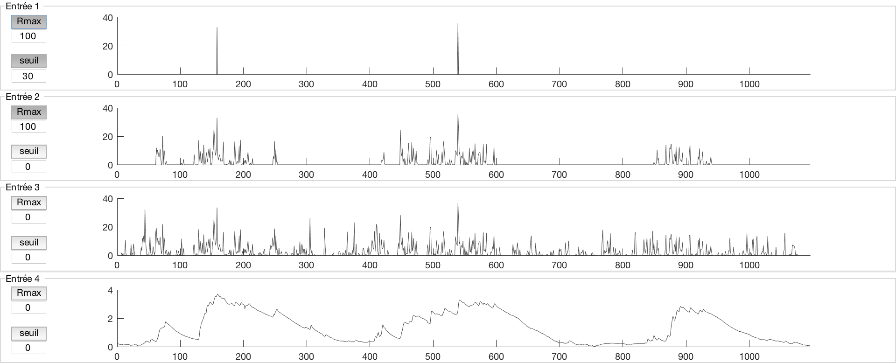

Entrées
=======

La partie inférieure gauche de l’interface graphique réunie les éléments relatifs aux entrées du modèle. Les quatre entrées du modèle sont tracées sur quatre graphiques superposés. Les axes des abscisses sont identiques de manière à pouvoir étudier la concordance temporelle des variables d’entrée. Si les chroniques d’entrée n’ont pas le même nombre d’élément, c’est le nombre d’élément le plus petit qui est utilisé. Par exemple, si deux chroniques sont importées, 2000 données pour la pluie et 1900 données pour la hauteur piézométrique, les deux chroniques ne sont représentées que jusqu’au pas de temps 1900 (et la sortie n’est pas calculée au-delà).

À droite de chaque graphique se trouve deux boutons accompagnés de deux zones de texte modifiable. Le premier bouton « RU » est utilisé pour signaler que la chronique correspondante est une chronique de pluie brute qui doit être transformée en pluie efficace à l’aide d’une chronique d’ETP. En cliquant sur le bouton, MASH demande à l’utilisateur de charger une chronique d’ETP si ce n’est pas déjà fait, puis calcule la pluie efficace grâce la réserve utile maximum Rmax défini par l’utilisateur dans la zone de texte.

Le deuxième bouton « seuil » permet quant à lui de seuiller une chronique : toutes les valeurs inférieures à la valeur définie dans la zone de texte sont rendues égales à zéro quand ce bouton est activé.
