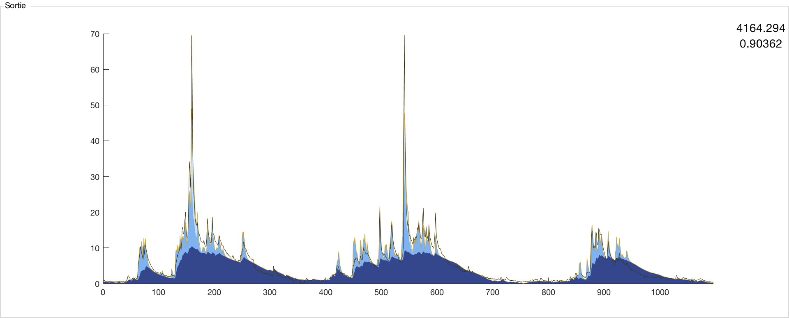

Sorties
=======

Les éléments représentant la sortie sont situés directement au-dessus des entrées.

La sortie est tracée dans un graphique dont l’axe des abscisses correspond à celui utilisé pour les différentes entrées ce qui permet de relier facilement les événements entrée-sortie ayant lieu simultanément, ou d’observer leur éventuel décalage. Si le nombre de donnée :math:`n_s` de sortie est inférieur au nombre de données d’entrée :math:`n_e`, seuls les :math:`n_s` premier éléments de la chronique d’entrée sont utilisés. Par exemple, dans le cas d’un modèle pluie-débit, s’il y a 5000 données de pluie et 1000 données de débits, seules les 1000 premières données de la chronique de pluie sont utilisées. Dans le cas ne est supérieur à ns, un message d’erreur s’affiche, invitant l’utilisateur à choisir une chronique d’entrée au moins aussi longue que le chronique de sortie.

Plusieurs courbes sont tracées sur le graphique :

* La courbe en trait fin de couleur noir correspond à la sortie mesurée. Dans le cadre d’un modèle pluie-débit, il s’agira du débit mesuré in-situ, celui que le modèle tente de reproduire.

* La courbe en trait fin de couleur rouille correspond à la sortie simulée, c’est-à-dire à la somme contribution apporté par chaque branche, la somme des entrées convoluées par leur fonction de transfert respective.

* Les aires en bleu (du bleu foncé au bleu clair) représentent les contributions à la sortie totale des différentes branches, de manière cumulée. Chaque aire correspond au produit d’une entrée par sa fonction de transfert. Ces aires permettent d’identifier rapidement quelles entrées ont la plus grande contribution à la sortie. Attention toutefois : MASH est avant tout un outil de traitement du signal et, comme on l’a vu précédemment, les problèmes étudiés ici sont « mal-posés ». Il est donc théoriquement possible de trouver différentes combinaisons d’entrées permettant de donner la même sortie et par conséquent l’affirmation consistant à dire que « la pluie contribue à X% du débit et la nappe à Y% » est erronée. La seule chose qu’il est possible d’affirmer avec certitude est que « la pluie permet d’expliquer X% du débit et la nappe Y% » et c’est tout.
148

Deux paramètres mesurant la qualité de l’ajustement sont affichés à titre indicatif dans le coin supérieur droit de cette partie : la somme des écarts quadratiques en haut et le coefficient de Nash-Sutcliffe en bas. Les deux paramètres sont inversement proportionnels à la qualité de l’ajustement. Le premier (compris entre zéro et l’infini) donne une mesure plus précise tandis que le second (compris entre moins l’infini et un) permet de comparer des problèmes ayant des nombres de données différents. Ils sont utiles pour les premières tentatives de calage du modèle en mode manuel, ainsi que pour vérifier le bon fonctionnement des algorithmes d’optimisation, en s’assurant que l’ajustement donné par l’algorithme et celui affiché dans l’interface graphique concordent.
