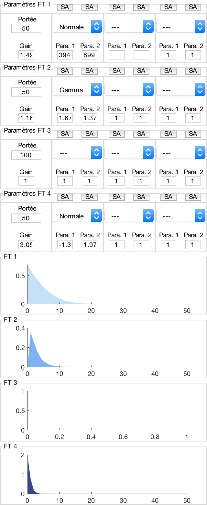

Fonctions de transfert
======================

La zone droite de l’interface graphique est consacrée aux fonctions de transfert, représentées graphiquement dans la partie inférieure et dont les paramètres sont affichés dans la partie supérieure.

Les représentations graphiques des fonctions de transfert sont de la même couleur que les contributions à la sortie correspondantes sur le graphique des sorties, ce qui permet d’identifier rapidement quelle fonction de transfert engendre quelle contribution à la sortie. L’axe des ordonnées des graphiques correspond au gain des fonctions de transfert ; l’axe des abscisses au temps. À noter que les fonctions de transfert représentées sont les fonctions de transfert équivalentes, égales au produit de convolution des trois fonctions de transfert élémentaires de la branche considérée.

Au-dessus des représentations graphiques se trouvent les différents paramètres des fonctions de transfert. Chaque branche est composée de 8 zones de texte modifiable, de 7 sliders (qui modifient le même paramètre que la zone de texte modifiable qu’ils surmontent) et 3 menus déroulant. La partie la plus à gauche de la branche est consacrée au contrôle de la fonction de transfert équivalente : la zone de texte supérieure permet de régler sa longueur ; la zone de texte inférieure et le slider, son gain. Viennent ensuite trois blocs similaires, correspondant aux trois fonctions de transfert en série. Le menu déroulant permet de choisir la fonction de transfert parmi les cinq fonctions de transfert présentées précédemment (la chaine de caractère ``---`` indique qu’aucune fonction de transfert n’est sélectionnée). Les deux zones de texte ainsi que les sliders qui y sont associés permettent quant à eux de modifier la valeur des deux paramètres de la fonction de transfert sélectionnée. Les boutons ``SA`` permettent d’afficher la dérivée partielle de la fonction de transfert par rapport au paramètre correspondant. Pour finir, il est possible de masquer les zones de textes et les paramètres des sliders pour plus de lisibilité.
