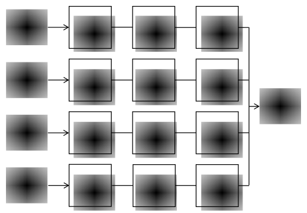

Architecture
============

Une des principales différences entre MASH et les autres modèles systémiques ou conceptuels réside dans son architecture particulière associant fonction de transfert en série et en parallèle, ainsi que dans sa versatilité lui permettant de s’adapter à un grand nombre de situation, étant donné que le modèle peut utiliser d’une à douze fonctions de transfert (quatre branches en parallèle de chacune trois fonctions en série).

Trois caractéristiques du modèle sont laissées à discrétion de l’utilisateur pour chaque nouveau problème : le nombre d’entrées, le nombre de fonctions de transfert en série et le type de fonctions de transfert utilisé.

Versatilité
-----------

Le nombre d’entrées, compris entre un et quatre, définit également le nombre de branches parallèles que comporte le modèle. Le nombre de fonctions de transfert en série, compris entre un et trois, impose la taille de chacune des branches. Le type de fonction de transfert paramétrique est choisi pour chacune des fonctions du modèle au sein d’une bibliothèque comportant actuellement quatre fonctions type mais pouvant être étendue ultérieurement.

MASH possède donc dans sa version la plus simple une entrée et une fonction de transfert :

et dans sa version la plus complexe quatre entrées et douze fonctions de transfert :

La sortie :math:`S (t )` est calculée comme étant la somme des produits de convolutions des entrées par les fonctions de transfert de chaque branche :

:math:`S ( t ) = E _ { 1 } * H _ { 1 } ^ { e q } ( t ) + E _ { 2 } * H _ { 2 } ^ { e q } ( t ) + E _ { 3 } ^ { * } H _ { 2 } ^ { e q } ( t ) + E _ { 4 } ^ { * } H _ { 2 } ^ { e q } ( t )`

où :math:`E_i` est la i\ :sup:`ème` entrée du modèle et :math:`H _ { i } ^ { e q }` est la i\ :sup:`ème` fonction de transfert équivalente égale au produit de convolution des trois fonctions de transfert élémentaires d’une branche :

:math:`H _ { i } ^ { e q } ( t ) = K _ { i } ^ { e q } \cdot \left( H _ { i } ^ { 1 } * H _ { i } ^ { 2 * } H _ { i } ^ { 3 } ( t ) \right)`

où :math:`K _ { i } ^ { e q }` est le gain de la i\ :sup:`ème` branche et :math:`H _ { i } ^ { \alpha }` est la :math:`\alpha`\ :sup:`ème` fonction de transfert de la i\ :sup:`ème` branche. Les fonctions de transfert élémentaires inutilisées sont égales à la distribution de Dirac étant donné que celle-ci est l’élément neutre du produit de convolution.

En couplant cette architecture modulaire avec la possibilité de choisir individuellement chacune des fonctions élémentaires de transfert, les capacités d’adaptation du modèle sont importantes. Dans les modèles à base physique, alors même que les équations explicitant les transferts sont a priori complètement définies en amont au sein du logiciel, l’utilisateur crée un modèle sur mesure adapté au problème (en définissant l’extension du maillage, le nombre de couches géologiques aquifères et aquitards, etc.),

Dans une moindre mesure, MASH est également un générateur de modèle à mesure, plus qu’un système figé. En dépit du postulat sur des relations de convolution entre les entrées et la sortie, de nombreuses options sont laissées à l’appréciation du modélisateur afin qu’il dispose d’un modèle adapté au problème qu’il désire résoudre, plutôt que d’essayer de contraindre le problème afin que celui-ci s’adapte au modèle.

Architecture en série et en parallèle
-------------------------------------

L’utilisation de fonctions de transfert en série permet de modéliser des phénomènes ayant lieu successivement (Figure II-6, a, b et c). Ainsi, dans les modèles conceptuels, la fonction de production est en série avec la fonction de transfert : les chroniques de précipitations brutes sont d’abord transformées en chronique de précipitations efficaces par la fonction de production, puis en chronique de débit par la fonction de transfert, suivant ainsi le parcours réel de l’eau à travers l’hydrosystème. De la même manière, les fonctions de transfert en série de MASH représentent les différents phénomènes ayant lieu les uns à la suite des autres. On peut par exemple imaginer d’utiliser trois fonctions de transfert en série : la première, une loi normale, traduira le caractère diffusif de l'infiltration à partir de la surface du bassin versant ; la deuxième, une loi Gamma, simulera la vidange de l’aquifère ; la troisième, une fonction retard pur, représentera le transfert entre matrice et conduit karstique.

L’utilisation de fonctions de transfert en parallèle permet de modéliser des phénomènes ayant lieu simultanément. Ainsi, dans les modèles conceptuels, la fonction de transfert correspondant aux écoulements dits « rapides » est en parallèle avec la fonction de transfert correspondant aux écoulements dits «lents»: les chroniques de précipitations efficaces sont séparées en deux composantes qui forment les entrées des fonctions « rapide » et « lente ». Les fonctions de transfert en parallèle de MASH représentent différents phénomènes d'occurrence simultanée. Ces fonctions en parallèle peuvent par exemple être utilisées pour modéliser différents types d’écoulements : une fonction pour les écoulements à temps caractéristique court comme le ruissellement et une fonction pour les écoulements lents comme la vidange d’une nappe. La précipitation efficace tombée à un instant t participera à ces deux écoulements. La mise en parallèle des fonctions de transfert permet également de rendre compte d’une certaine hétérogénéité des hydrosystèmes qui ne va pas forcément de pair avec les modèles systémiques. On peut en effet considérer que les branches parallèles simulent divers sous-bassins ou des zones ayant des comportements (comme des temps de transfert moyens) différents. Les fonctions parallèles peuvent ainsi représenter des entités ayant des géologies et/ou des géomorphologies différentes. À noter toutefois qu’il est nécessaire d’utiliser des chroniques d’entrées différentes pour chacune des branches parallèles eût égard à la distributivité du produit de convolution sur l’addition. Il faudra utiliser des chroniques pluviométriques relevées à des stations différentes, ou jouer sur les paramètres de réserve utile maximum ou de seuil afin d’obtenir des entrées différenciées. Enfin, l’utilisation de branches parallèles permet d’utiliser des entrées de nature différente : il est par exemple possible d’utiliser une chronique de précipitations pour simuler la composante haute fréquence de la chronique de débit, et une chronique de hauteurs piézométriques pour en simuler la composante basse fréquence.
