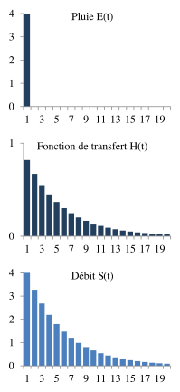
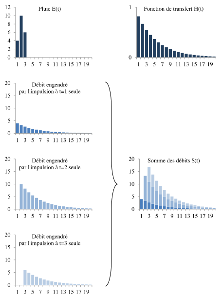

Convolution
===========

Le modèle MASH utilise une approche basée sur les fonctions de transfert (ou noyaux de convolution) pour modéliser les hydrosystèmes. Cette méthode, proche des théories issues du traitement du signal et de l’automatisme, consiste à établir une relation mathématique entre deux signaux, l’entrée et la sortie du système, via un produit de convolution. On peut interpréter le produit de convolution comme étant le filtrage du signal d’entrée par une fonction de transfert, produisant ainsi un signal de sortie. De ce fait, on peut considérer que la fonction de transfert représente par exemple la manière dont le terrain filtre la pluie interceptée par le sol du bassin versant pour donner le débit de la rivière en sortie du bassin versant. La sortie du système :math:`S(t)` est égale au produit de convolution de l’entrée :math:`E(t)` et de la fonction de transfert :math:`H(t)` définie par :

:math:`S ( t ) = ( E * H ) ( t ) = \int _ { 0 } ^ { t } E ( \tau ) . H ( \mathrm { t } - \tau ) \cdot \mathrm { d } \tau`

Considérons, dans le cas d’un bassin versant, une entrée définie par la chronique des pluies, la sortie définie par le débit d'une rivière. En isolant un évènement pluvieux de type impulsion, c’est-à-dire de durée inférieure ou égale au pas de temps d’échantillonnage, la réponse en débit du système est égale à sa fonction de transfert, multiplié par l’intensité de l’impulsion.

Après avoir caractérisé le système, en ayant calculé sa réponse impulsionnelle, il est possible de calculer la valeur de la sortie au temps :math:`t` à partir de la chronique d’entrée en faisant la somme de versions de la fonction de transfert translatées et multipliées par l’amplitude d’entrée de l’impulsion.

